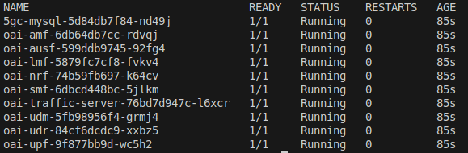
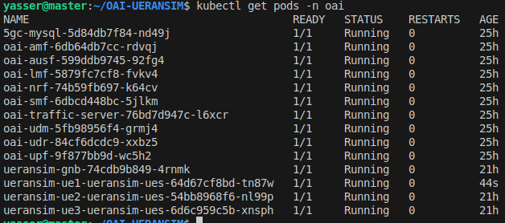
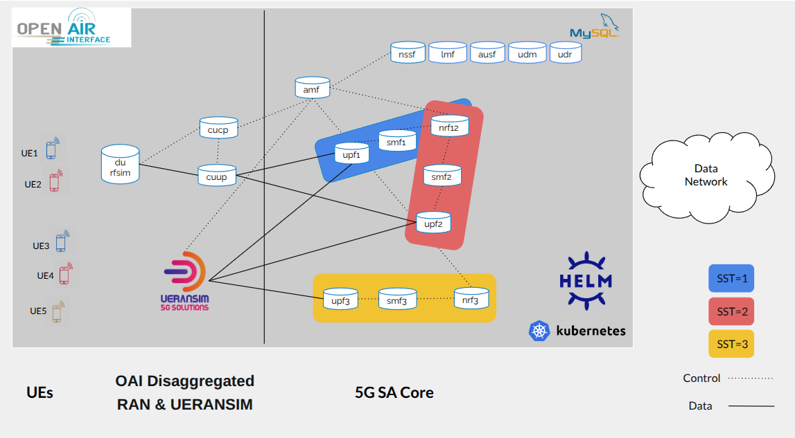

# OpenAirInterface 5G Core Network Deployment on a Kubernetes cluster and Testing with UERANSIM and Iperf3 for traffic generation

<div align="center">
    
</div>

## Description

This documentation provides a comprehensive guide to building a Kubernetes (K8s) cluster and deploying the OpenAirInterface (OAI) 5G Standalone (SA) Core on it. The tutorial walks through each step, starting with the setup of the K8s cluster, followed by the deployment of the OAI 5G SA Core and integration of UERANSIM — all using Helm charts. It concludes with performance testing using iperf3 and monitoring with Prometheus and Grafana.

<!-- Docker plays a crucial role in both the general containerization space and the specific domains of K8s and 5G. It facilitates the creation and management of lightweight, isolated containers, allowing for efficient application deployment and scalability. Within the context of K8s, Docker is instrumental in packaging and running applications as containers, which can then be orchestrated by K8s across the cluster. K8s is an open-source container orchestration platform that simplifies the management and deployment of containerized applications at scale. 

The components kubeadm, kubelet, and kubectl are essential for the operation of a K8s cluster. Kubeadm is a command-line tool that simplifies the setup and initialization of a K8s cluster. Kubelet is the primary node agent responsible for managing containers on individual nodes, while kubectl is a versatile command-line interface for interacting with the K8s cluster, facilitating tasks such as deployment management, scaling, and monitoring.-->

We use OAI 5G Core version v2.1.0 which creates an open source and cloud native platform that implement the 5G Release 16 (3GPP TS 29.571 Release 16.13.0) Core Network virtual functions as pods on the top of K8S cluster. A total of 10 pods ensure the operation of the OAI 5G Core Network, including MySQL, NRF, UDR, UDM, AUSF, AMF, SMF, and UPF. The MySQL pod is used by the UDR and UDM functions to store and manage user data, subscription information, and policy-related configurations. The Network Repository Function (NRF) maintains a registry of network functions and their capabilities, supporting service discovery and communication between components. The UDR and UDM handle subscriber data management and provide the framework for policy control and access to user profiles. The Authentication Server Function (AUSF) enables the AMF to authenticate the User Equipment (UE) and grant access to core services. The Access and Mobility Management Function (AMF) serves as the main signaling point for UE connections and mobility. The Session Management Function (SMF) manages PDU sessions, including IP allocation and session control. Finally, the User Plane Function (UPF) routes user traffic between the Radio Access Network (RAN) and external data networks. More details can be found in this link “https://openairinterface.org/oai-5g-core-network-project/”.

In addition, we connect the UERANSIM simulator to the OAI 5G Core. UERANSIM is an open-source simulator that emulates both a 5G UE and a gNodeB (gNB), effectively representing a 5G mobile device and base station. It is used to generate traffic within the network slice and to evaluate performance and energy consumption.

Please note that this tutorial focuses on the Linux Ubuntu 64-bit operating system. While the overall concepts remain applicable, some specific steps may vary for other operating systems.

The tutorial video is available on youtube: https://www.youtube.com/playlist?list=PLu0ii58C1Y3vNpRMZwYCsb17PvyF-i4WU
## Contributors

- Massinissa AIT ABA, massinissa.ait-aba@davidson.fr
- Yasser BRAHMI, abdenour-yasser.brahmi@telecom-sudparis.eu
- Ali AL KHANSA, ali.al_khansa@telecom-sudparis.eu

## Table of Contents

- [Build a K8s cluster](#build-a-k8s-cluster)
- [Tools Setup: Helm, Multus, and Namespace](#tools-setup-helm-multus-and-namespace)
- [OAI 5G SA Core Deployment](#oai-5g-sa-core-deployment)
- [UERANSIM Deployment](#ueransim)
- [Monitoring](#setup-prometheus-monitoring)
- [Generate traffic using iPerf3](#generate-traffic-using-iperf3)
- [Beyond the Basics: Network Slicing and Collaboration](#beyond-the-basics-network-slicing-and-collaboration)


<!-- - [OAI core script using setpodnet-scheduler](#oai-core-script-using-setpodnet-scheduler) -->
# Build a K8s cluster
We assume that a Kubernetes cluster is already running using this repository: https://github.com/AIDY-F2N/build-k8s-cluster

# Tools Setup: Helm, Multus, and Namespace

1.  Install the Helm CLI usnig this link: https://helm.sh/docs/intro/install/

Helm CLI (Command-Line Interface) is a command-line tool used for managing applications on Kubernetes clusters. It is part of the Helm package manager, which helps you package, deploy, and manage applications as reusable units called Helm charts.

Helm provides a straightforward way to define, install, and upgrade complex Kubernetes applications. With Helm, you can define the desired state of your application using a declarative YAML-based configuration file called a Helm chart. A Helm chart contains all the necessary Kubernetes manifests, configurations, and dependencies required to deploy and run your application.

2.  Install Helm Spray using this command: 
```bash[language=bash]
helm plugin install https://github.com/ThalesGroup/helm-spray
```
Helm Spray is a Helm plugin that simplifies the deployment of Kubernetes applications using Helm charts. Helm is a package manager for Kubernetes that allows you to define, install, and manage applications as reusable units called charts. Helm Spray extends Helm's functionality by providing additional features and capabilities for managing the lifecycle of complex deployments. The command helm plugin install installs the Helm Spray plugin, enabling you to use its functionalities alongside Helm.

3. Clone Multus GitHub repository
```bash[language=bash]
git clone https://github.com/k8snetworkplumbingwg/multus-cni.git
```
  - Apply a daemonset which installs Multus using kubectl. From the root directory of the clone, apply the daemonset YAML file:
    ```bash[language=bash]
    kubectl apply -f multus-cni/deployments/multus-daemonset-thick.yml
    ```
4. Create a namespace where the helm-charts will be deployed, in this tutorial, we deploy them in oai namespace. To create oai namespace use the below command on your cluster: 
    ```bash[language=bash]
    kubectl create ns oai
    ```

5. Clone this repository:
```bash[language=bash]
git clone https://github.com/AIDY-F2N/OAI-UERANSIM.git
```

# OAI 5G SA Core Deployment

1. Open a terminal inside the folder "OAI-UERANSIM/OAI+UERANSIM", and run the following commands to deploy the OAI core:
```bash[language=bash]
helm dependency update oai-5g-core/oai-5g-basic
helm install 5gc oai-5g-core/oai-5g-basic/ -n oai
```
The two commands you provided are related to the Helm package manager and are used to manage and deploy Helm charts onto a Kubernetes cluster. 

After this, run this command to check if the core is deployed: 
```bash[language=bash]
kubectl get pods -n oai 
```

<div align="center">
    
</div>

## OAI 5G SA Core Deployment with SetPodNet Scheduler (optional)

**Note:** You should choose **either** the standard **OAI 5G SA Core Deployment**  **or** the **OAI 5G SA Core Deployment with SetPodNet Scheduler**—but **not both at the same time**

Coscheduling refers to the ability to schedule a group of pods at once, as opposed to the default Kubernetes behavior that schedules pods one-by-one. [setpodnet-scheduler](https://github.com/AIDY-F2N/setpodnet-scheduler) is a custom Kubernetes scheduler designed to optimize the deployment of multi-pod applications by addressing the limitations of Kubernetes’ default scheduling approach. Unlike the default scheduler, which deploys pods independently, setpodnet-scheduler considers latency and bandwidth constraints between nodes and prioritizes co-locating connected pods on the node. This approach improves resource efficiency, reduces inter-pod latency, and enhances overall cluster performance and resource management. 

1. Open a terminal inside the folder "OAI-UERANSIM/OAI+UERANSIM" and deploy [setpodnet-scheduler](https://github.com/AIDY-F2N/setpodnet-scheduler) using the following command:

```bash[language=bash]
kubectl apply -f setpodnet-scheduler.yaml
```

2. Add latency and bandwidth constraints between pods: The User Plane Function (UPF) is a critical component in 5G networks, enabling low latency and high throughput. To optimize its deployment and ensure efficient communication with other core network functions, we need to specify constraints that reflect the UPF's requirements. For example, we have added constraints to the values file of the UPF pod (OAI-UERANSIM/OAI+UERANSIM/oai-5g-core-setpodnet/oai-upf/values.yaml) between UPF and SMF, and between UPF and AMF, using the following annotations:

```yaml
annotations:
  communication-with: "oai-amf,oai-smf"
  latency-oai-amf: "10"
  bandwidth-oai-amf: "1"
  latency-oai-smf: "10"
  bandwidth-oai-smf: "1"
```

The value latency-oai-amf: "10" represents the latency requirement on a scale of 1 to 10, where 1 is poor and 10 is excellent. In this case, a value of 10 indicates an excellent (lowest) latency requirement for communication between the UPF and AMF pods. The scheduler will prioritize placing these pods on nodes that can meet this high-quality latency requirement.
This scaling system allows for more nuanced expression of network requirements, where higher values represent better performance expectations. It's important to adjust these values based on the specific needs of your network configuration and the relative importance of low latency between different pods.


These constraints are crucial for optimizing the deployment of OAI core network components using setpodnet-scheduler. By specifying communication relationships, latency requirements, and bandwidth allocations between UPF, AMF, and SMF, we enable the scheduler to make informed decisions about pod placement. This approach ensures optimal network conditions, maintains responsiveness, and helps prevent bandwidth exhaustion, which is particularly important for the UPF's role in data processing and forwarding.

You can add your own constraints based on your specific network requirements and topology. The setpodnet-scheduler is flexible and can accommodate custom constraints for different components of the 5G core network. You can modify the values files for other network functions (e.g., AMF, SMF) to add similar annotations, adjusting the latency and bandwidth values as needed for their particular use case or network design. For more information on using setpodnet-scheduler, visit https://github.com/AIDY-F2N/setpodnet-scheduler.


3. Open a terminal inside the folder "OAI-UERANSIM/OAI+UERANSIM", and run the following commands to deploy the OAI core:
```bash[language=bash]
helm dependency update oai-5g-core-setpodnet/oai-5g-basic
helm install 5gc oai-5g-core-setpodnet/oai-5g-basic/ -n oai
```
The two commands you provided are related to the Helm package manager and are used to manage and deploy Helm charts onto a Kubernetes cluster. 
After this, run this command to check if the core is deployed: 
```bash[language=bash]
kubectl get pods -n oai 
```

<div align="center">
    
</div>


# UERANSIM Deployment


UERANSIM stands for User Equipment (UE) and Radio Access Network (RAN) Simulator. It is an open-source software tool that simulates the behavior of a 5G RAN, specifically emulating the functions of both the UE and the gNB. UERANSIM allows users to replicate 5G UE behaviors such as mobility, radio resource management, connection establishment, and data transfer. It provides a realistic environment for testing and evaluating the performance of 5G networks and applications.


1.  Open a terminal inside the folder "OAI-UERANSIM/OAI+UERANSIM", launch the gNB with the release name "ueransim-gnb":

```bash[language=bash]
helm install ueransim-gnb ueransim-5g-ran/ueransim-gnb/ -n oai
```

Check the pod name and view the logs:

```bash[language=bash]
kubectl get pods -n oai | grep gnb
kubectl logs -n oai <pod name>
```

<div align="center">
    
</div>


2. Open a terminal inside the folder "OAI-UERANSIM/OAI+UERANSIM", launch a UE: 

```bash[language=bash]
helm install ueransim-ue1 ueransim-5g-ran/ueransim-ue1/ -n oai
```
check pod name and logs: 
```bash[language=bash]
kubectl get pods -n oai | grep ue
kubectl logs -n oai <pod name>
```


<div align="center">
    
</div>

Repeat this step for ue2, ue3, etc. If you want more UEs, you can either copy and modify a UE Helm chart (changing the IMSI, release name, etc.) or configure the ueransim-gnb Helm chart to launch multiple UEs. The latter approach will be discussed in detail in the Testing with iperf3 section.

Observe the gNB logs (3 UEs are connected):
<div align="center">
    
</div>

The cluster should now contain:

<div align="center">
    
</div>

3. Run a traffic test using ping from a UE pod:

```bash[language=bash]
kubectl exec -it -n oai <pod name> -- ping -c 3 -I uesimtun0 google.com
```
<div align="center">
    
</div>
 

 
# Monitoring

Execute the following command to create a new namespace named monitoring.

```bash[language=bash]
cd monitoring
kubectl create namespace monitoring
```

## Setup Prometheus

In this phase, we set up Prometheus on our Kubernetes cluster. This setup collects node, pods, and service metrics automatically using Prometheus service discovery configurations. Prometheus is a high-scalable open-source monitoring framework. It provides out-of-the-box monitoring capabilities for the Kubernetes container orchestration platform. Also, In the observability space, it is gaining huge popularity as it helps with metrics and alerts.

1.  Prometheus uses Kubernetes APIs to read all the available metrics from Nodes, Pods, Deployments, etc. For this reason, we need to create an RBAC policy with read access to required API groups and bind the policy to the monitoring namespace.  The file named clusterRole.yaml contains the RBAC role. In this role, we have added get, list, and watch permissions to nodes, services endpoints, pods, and ingresses. The role binding is bound to the monitoring namespace. If you have any use case to retrieve metrics from any other object, you need to add that in this cluster role. Create the role using the following command.

```bash[language=bash]
cd prometheus
kubectl create -f clusterRole.yaml
```

2. Create a Config Map To Externalize Prometheus Configurations :
All configurations for Prometheus are part of prometheus.yaml file and all the alert rules for Alertmanager are configured in prometheus.rules. By externalizing Prometheus configs to a Kubernetes config map, you don’t have to build the Prometheus image whenever you need to add or remove a configuration. You need to update the config map and restart the Prometheus pods to apply the new configuration. Execute the following command to create the config map in Kubernetes.


```bash[language=bash]
kubectl create -f config-map.yaml
```

3. Create a Prometheus Deployment :  In the  configuration given in the file prometheus-deployment.yaml, we are mounting the Prometheus config map as a file inside /etc/prometheus. This deployment uses the latest official Prometheus image from the docker hub. Also, we are not using any persistent storage volumes for Prometheus storage as it is a basic setup. Create a deployment on monitoring namespace using the the following command.


```bash[language=bash]
kubectl create  -f prometheus-deployment.yaml 
```

You can check the created deployment using the following command.

```bash[language=bash]
kubectl get deployments --namespace=monitoring
```

<div align="center">
    
</div>


You can check the created pod using the following command.

```bash[language=bash]
kubectl get pods --namespace=monitoring
```

<div align="center">
    
</div>


4. Exposing Prometheus as a Service [NodePort \& LoadBalancer]: To access the Prometheus dashboard over a IP or a DNS name, you need to expose it as a Kubernetes service.The annotations in the service YAML given by "prometheus-service.yaml" makes sure that the service endpoint is scrapped by Prometheus. The prometheus.io/port should always be the target port mentioned in service YAML.

- Create the service using the following command:
    
```bash[language=bash]
kubectl create -f prometheus-service.yaml --namespace=monitoring
```


## Setup Kube State Metrics on Kubernetes
Kube State metrics is a service that talks to the Kubernetes API server to get all the details about all the API objects like deployments, pods, daemonsets, Statefulsets, etc. Primarily it produces metrics in Prometheus format with the stability as the Kubernetes API. Overall it provides kubernetes objects \& resources metrics that you cannot get directly from native Kubernetes monitoring components.

Kube state metrics is available as a public docker image.  In the "OAI-UERANSIM" folder, use the following command to deploy the following Kubernetes objects needed for Kube state metrics to work. It deploys a Service Account, a Cluster Role for kube state metrics to access all the Kubernetes API objects, a Cluster Role Binding and a Kube State Metrics Deployment Service to expose the metrics. 

```bash[language=bash]
kubectl apply -f kube-state-metrics-configs/
```

Check the deployment status using the following command: 
```bash[language=bash]
kubectl get deployments kube-state-metrics -n kube-system
```


<div align="center">
    
</div>


## Setup Grafana
Grafana is an open-source lightweight dashboard tool. It can be integrated with many data sources like Prometheus, AWS cloud watch, Stackdriver, etc. Using Grafana you can simplify Kubernetes monitoring dashboards from Prometheus metrics.  All the needed files are in the kubernetes-grafana folder.


     
1. Create the configmap using the following command
```bash[language=bash]
cd grafana
kubectl create -f grafana-datasource-config.yaml
```

2. Create the deployment : 

```bash[language=bash]
kubectl create -f deployment.yaml
```

3. Create the service:

```bash[language=bash]ssh aidyf2n@137.194.104.5
kubectl create -f service.yaml
```

4. Now you should be able to access the Grafana dashboard. You can  use port forwarding using the following command (Replace  &lt;grafana-pod-name&gt; by the name of your grafana pod )

```bash[language=bash]
kubectl port-forward -n monitoring <grafana-pod-name> 3000 &
```
Make sure the port is allowed in the firewall to be accessed from your workstation.

<div align="center">
    
</div>


5. You will be able to access Grafana a from http://localhost:3000
```bash[language=bash]
User: admin
Pass: admin
```

<div align="center">
    
</div>


6. Create Kubernetes Dashboards on Grafana: first, Head over to the Grafana dashbaord and select the import option:

<div align="center">
    
</div>


    1.  Upload the dashboard JSON file "Kubernetes Pods monitoring via Prometheus.json"

<div align="center">
    
</div>


    2. Grafana will automatically fetch the template:

<div align="center">
    
</div>


    3. The dashboard will then have this interface:

<div align="center">
    
</div>


# Generate traffic using iPerf3
 iPerf3 is a tool for performing network throughput measurements.  It can test TCP, UDP, or SCTP throughput.  To perform an iPerf3 test the user must establish both a  server  and  a client.  The iPerf3 executable contains both client and server functionality. To install and test iPerf3 on Ubuntu, follow the link https://linuxhint.com/install-iperf3-ubuntu/ (optional).


To generate traffic, follow these steps:

1. If the gNB and UEs are already running, identify and uninstall them:
```bash[language=bash]
helm ls -n oai
helm uninstall -n oai <ueransim-gnb> <ueransim-ue1> ...
```

2. Here's a simple way to deploy a large number of UEs. Enable UE creation and set the number of UEs you want to deploy:

```bash[language=bash]
helm install ueransim-gnb ueransim-5g-ran/ueransim-gnb/ -n oai \
  --set ues.enabled=true \
  --set ues.count=<number_of_UEs>
```

This will create two pods: one containing the ueransim-gnb, and the other hosting all the UEs.
```bash[language=bash]
kubectl get pods -n oai | grep ueransim
```

<div align="center">
    
</div>

You can verify the deployment either by checking the logs of ueransim-gnb or by accessing the UE pod to view the interfaces from uesimtun0 to uesimtun<number_of_UEs-1>. Each should have an IP address and be able to ping:

```bash[language=bash]
kubectl logs -n oai <ueransim-gnb-pod-name>
kubectl exec -n oai <ueransim-ues-pod-name> -- ip a
kubectl exec -n oai <ueransim-ues-pod-name> -- ping -c 4 -I uesimtun0 google.com
```

2. Deploy iperf3 using the following command : 
```bash[language=bash]
kubectl run iperf3 --image=maitaba/iperf3:latest
```
 
iperf3 pod acts as server which is listening to 100 ports from 5201 to 5301. By default, the iPerf3 server will listen to all active interfaces of the host for new connections. 


3.  Run the following script, UEs will act as clients to connect with the server (at most 100) and connect to an iperf3 server during &lt;seconds&gt; seconds.   
```bash[language=bash]
chmod +x run_iperf3_tests.sh
./run_iperf3_tests.sh <secondes> #60 seconds by default 
```

4. Evaluate the Impact of Varying the Number of UEs

To generate the traffic of x in {5, 10, 15, 20, 25, 30, 35, 40, 45, 50} UEs, during 6 minutes for each,  run the following script.  It will launch the specified number of UEs (up to a maximum of 100), each acting as a client connecting to the server:

```bash[language=bash]
chmod +x run_load.sh
./run_load.sh
```

# Uninstall Core and RAN Components

Identify and uninstall the "5gc" and "ueransim-gnb" releases:
```bash[language=bash]
helm ls -n oai
helm uninstall -n oai 5gc ueransim-gnb
```


# Beyond the Basics: Network Slicing and Collaboration

For a more advanced and **fully open-source network slicing platform**, explore our GitHub repository [**NexSlice**](https://github.com/AIDY-F2N/NexSlice.git), which includes:

- Complete deployment instructions using **Kubernetes** and **Helm Charts**
- Core slicing with **SST-based differentiation**
- Integration of **UERANSIM**, disaggregated **OAI RAN**, and real-time monitoring
- The architecture shown below is fully reproducible using the steps provided in the repository’s README

<div align="center">
  
</div>

For questions, collaboration, or more details, feel free to reach out:  
- **Massinissa AIT ABA** – massinissa.ait-aba@davidson.fr  
- **Yasser BRAHMI** – abdenour-yasser.brahmi@telecom-sudparis.eu  

We’d be happy to connect and share more!


 
