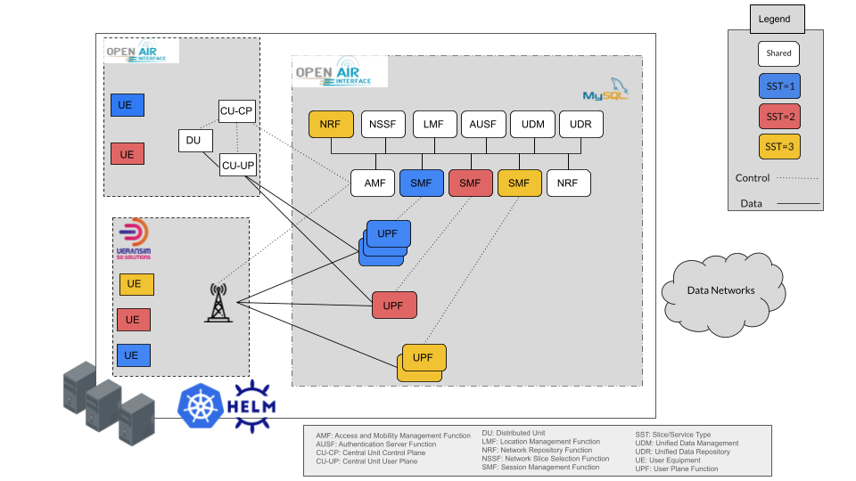

# OpenAirInterface 5G Core Network Deployment on a Kubernetes (K8s) cluster and Testing with UERANSIM and Iperf3 for traffic generation

<div align="center">
    
</div>

## Description

This documentation offers a comprehensive guide to building a Kubernetes (K8s) cluster and configuring the OAI 5G core network on it. The tutorial outlines a step-by-step process, beginning with Docker installation, followed by setting up kubeadm, kubelet, and kubectl, and concluding with constructing the K8s cluster. Moreover, it demonstrates how to deploy OpenAirInterface (OAI) core network, and link and utilize UERANSIM (gNB and User Equipment (UE)). 

Docker plays a crucial role in both the general containerization space and the specific domains of K8s and 5G. It facilitates the creation and management of lightweight, isolated containers, allowing for efficient application deployment and scalability. Within the context of K8s, Docker is instrumental in packaging and running applications as containers, which can then be orchestrated by K8s across the cluster. K8s is an open-source container orchestration platform that simplifies the management and deployment of containerized applications at scale. 

The components kubeadm, kubelet, and kubectl are essential for the operation of a K8s cluster. Kubeadm is a command-line tool that simplifies the setup and initialization of a K8s cluster. Kubelet is the primary node agent responsible for managing containers on individual nodes, while kubectl is a versatile command-line interface for interacting with the K8s cluster, facilitating tasks such as deployment management, scaling, and monitoring.

By following the documented steps to install Docker and set up kubeadm, kubelet, and kubectl, participants will be able to successfully construct their own K8s cluster. This will provide the foundation necessary for subsequent installations, including the 5G platform composed of a 3GPP-Compliant 5G core network and a simulated RAN.

We use Open Air Interface (OAI) code (v2.1.0) which creates an open source and cloud native platform that implement the 5G Release 16 (3GPP TS 29.571 Release 16.13.0) Core Network virtual functions as pods on the top of K8S cluster. A total of 10 pods ensure the operations of the OAI Core Network (MySQL, NRF, UDR, UDM, AUSF, AMF, SMF, UPF...). The MySQL pod is used to store and manage important configuration and operational data related to the core network components. Network Repository Function (NRF) is responsible for storing and managing network-related information such as network slice templates, network slice instances and network function descriptions. Unified Data Repository (UDR) \& Unified Data Management (UDM) functions are DBs that store the user info and provide the policy control framework, applying policy decisions and accessing subscription information, to govern the network behavior. Authentication Server Function (AUSF) allows the AMF to authenticate the UE and access services of the 5G core. Access and Mobility Management Function (AMF) acts as a single-entry point for the UE connection. Session Management Function (SMF) used to manage the user sessions. UPF is a network function that acts as a gateway between the radio access network (RAN) and the core network. More details can be found in this link “https://openairinterface.org/oai-5g-core-network-project/”.

In addition, we connect the code of UERANSIM simulator (https://github.com/aligungr/UERANSIM) to the 5G OAI Core Network. UERANSIM is the open source 5G UE and RAN (gNodeB) simulator considered as a 5G mobile phone and a base station in basic terms. We use it to generate the traffic inside the slice and measure the performance and energy consumption. 


Please note that this tutorial focuses on the Linux Ubuntu 64-bit operating system. While the overall concepts remain applicable, some specific steps may vary for other operating systems.

The tutorial video is available on youtube: https://www.youtube.com/playlist?list=PLu0ii58C1Y3vNpRMZwYCsb17PvyF-i4WU
## Contributors

- Massinissa AIT ABA, massinissa.ait-aba@davidson.fr
- Yasser BRAHMI, abdenour-yasser.brahmi@telecom-sudparis.eu
- Ali AL KHANSA, ali.al_khansa@telecom-sudparis.eu

## Table of Contents

- [Build a K8S cluster](#build-a-k8s-cluster)
- [OAI core script](#oai-core-script)
- [OAI core script using setpodnet-scheduler](#oai-core-script-using-setpodnet-scheduler)
- [UERANSIM](#ueransim)
- [Setup Prometheus Monitoring](#setup-prometheus-monitoring)
- [Setup Kube State Metrics on Kubernetes](#setup-kube-state-metrics-on-kubernetes)
- [Setting Up Grafana](#setting-up-grafana)
- [Generate traffic using iPerf3](#generate-traffic-using-iperf3)


# Build a K8S cluster
We assume that a Kubernetes cluster is already running using this repository: https://github.com/AIDY-F2N/build-k8s-cluster

# OAI core script


We present the different steps to deploy the OAI core. 

1.  Install the Helm CLI usnig this link: https://helm.sh/docs/intro/install/

Helm CLI (Command-Line Interface) is a command-line tool used for managing applications on Kubernetes clusters. It is part of the Helm package manager, which helps you package, deploy, and manage applications as reusable units called Helm charts.

Helm provides a straightforward way to define, install, and upgrade complex Kubernetes applications. With Helm, you can define the desired state of your application using a declarative YAML-based configuration file called a Helm chart. A Helm chart contains all the necessary Kubernetes manifests, configurations, and dependencies required to deploy and run your application.

2.  Install Helm Spray using this command: 
```bash[language=bash]
helm plugin install https://github.com/ThalesGroup/helm-spray
```
Helm Spray is a Helm plugin that simplifies the deployment of Kubernetes applications using Helm charts. Helm is a package manager for Kubernetes that allows you to define, install, and manage applications as reusable units called charts. Helm Spray extends Helm's functionality by providing additional features and capabilities for managing the lifecycle of complex deployments. The command helm plugin install installs the Helm Spray plugin, enabling you to use its functionalities alongside Helm.

3. Clone this GitHub repository
```bash[language=bash]
git clone https://github.com/k8snetworkplumbingwg/multus-cni.git
```
  - Apply a daemonset which installs Multus using kubectl. From the root directory of the clone, apply the daemonset YAML file:
    ```bash[language=bash]
    cat ./deployments/multus-daemonset-thick.yml | kubectl apply -f -
    ```
4. Create a namespace where the helm-charts will be deployed, in this tutorial, we deploy them in oai namespace. To create oai namespace use the below command on your cluster: 
    ```bash[language=bash]
    kubectl create ns oai
    ```

5. Clone the following repository:
```bash[language=bash]
git clone https://github.com/AIDY-F2N/OAI-UERANSIM.git
```
6. Open a terminal inside the folder "OAI-UERANSIM/OAI+UERANSIM", and run the following commands to deploy the OAI core:
```bash[language=bash]
helm dependency update oai-5g-core/oai-5g-basic
helm install 5gc oai-5g-core/oai-5g-basic/ -n oai
```
The two commands you provided are related to the Helm package manager and are used to manage and deploy Helm charts onto a Kubernetes cluster. 
After this, run this command to check if the core is deployed: 
```bash[language=bash]
kubectl get pods -n oai 
```

<div align="center">
    
</div>

# OAI core script using setpodnet-scheduler

Coscheduling refers to the ability to schedule a group of pods at once, as opposed to the default Kubernetes behavior that schedules pods one-by-one. [setpodnet-scheduler](https://github.com/AIDY-F2N/setpodnet-scheduler) is a custom Kubernetes scheduler designed to optimize the deployment of multi-pod applications by addressing the limitations of Kubernetes’ default scheduling approach. Unlike the default scheduler, which deploys pods independently, setpodnet-scheduler considers latency and bandwidth constraints between nodes and prioritizes co-locating connected pods on the node. This approach improves resource efficiency, reduces inter-pod latency, and enhances overall cluster performance and resource management. 

Now, we present the different steps to deploy the OAI core using [setpodnet-scheduler](https://github.com/AIDY-F2N/setpodnet-scheduler). 


1.  Install the Helm CLI usnig this link: https://helm.sh/docs/intro/install/

Helm CLI (Command-Line Interface) is a command-line tool used for managing applications on Kubernetes clusters. It is part of the Helm package manager, which helps you package, deploy, and manage applications as reusable units called Helm charts.

Helm provides a straightforward way to define, install, and upgrade complex Kubernetes applications. With Helm, you can define the desired state of your application using a declarative YAML-based configuration file called a Helm chart. A Helm chart contains all the necessary Kubernetes manifests, configurations, and dependencies required to deploy and run your application.

2.  Install Helm Spray using this command: 
```bash[language=bash]
helm plugin install https://github.com/ThalesGroup/helm-spray
```
Helm Spray is a Helm plugin that simplifies the deployment of Kubernetes applications using Helm charts. Helm is a package manager for Kubernetes that allows you to define, install, and manage applications as reusable units called charts. Helm Spray extends Helm's functionality by providing additional features and capabilities for managing the lifecycle of complex deployments. The command helm plugin install installs the Helm Spray plugin, enabling you to use its functionalities alongside Helm.

3. Clone this GitHub repository
```bash[language=bash]
git clone https://github.com/k8snetworkplumbingwg/multus-cni.git
```
  - Apply a daemonset which installs Multus using kubectl. From the root directory of the clone, apply the daemonset YAML file:
    ```bash[language=bash]
    cat ./deployments/multus-daemonset-thick.yml | kubectl apply -f -
    ```
4. Create a namespace where the helm-charts will be deployed, in this tutorial, we deploy them in oai namespace. To create oai namespace use the below command on your cluster: 
    ```bash[language=bash]
    kubectl create ns oai
    ```
5. Clone the following repository:
```bash[language=bash]
git clone https://github.com/AIDY-F2N/OAI-UERANSIM.git
```

6. Open a terminal inside the folder "OAI-UERANSIM/OAI+UERANSIM" and deploy [setpodnet-scheduler](https://github.com/AIDY-F2N/setpodnet-scheduler) using the following command:

```bash[language=bash]
kubectl apply -f setpodnet-scheduler.yaml
```

7. Add latency and bandwidth constraints between pods: The User Plane Function (UPF) is a critical component in 5G networks, enabling low latency and high throughput. To optimize its deployment and ensure efficient communication with other core network functions, we need to specify constraints that reflect the UPF's requirements. For example, we have added constraints to the values file of the UPF pod (OAI-UERANSIM/OAI+UERANSIM/oai-5g-core-setpodnet/oai-upf/values.yaml) between UPF and SMF, and between UPF and AMF, using the following annotations:

```yaml
annotations:
  communication-with: "oai-amf,oai-smf"
  latency-oai-amf: "10"
  bandwidth-oai-amf: "1"
  latency-oai-smf: "10"
  bandwidth-oai-smf: "1"
```

The value latency-oai-amf: "10" represents the latency requirement on a scale of 1 to 10, where 1 is poor and 10 is excellent. In this case, a value of 10 indicates an excellent (lowest) latency requirement for communication between the UPF and AMF pods. The scheduler will prioritize placing these pods on nodes that can meet this high-quality latency requirement.
This scaling system allows for more nuanced expression of network requirements, where higher values represent better performance expectations. It's important to adjust these values based on the specific needs of your network configuration and the relative importance of low latency between different pods.


These constraints are crucial for optimizing the deployment of OAI core network components using setpodnet-scheduler. By specifying communication relationships, latency requirements, and bandwidth allocations between UPF, AMF, and SMF, we enable the scheduler to make informed decisions about pod placement. This approach ensures optimal network conditions, maintains responsiveness, and helps prevent bandwidth exhaustion, which is particularly important for the UPF's role in data processing and forwarding.

You can add your own constraints based on your specific network requirements and topology. The setpodnet-scheduler is flexible and can accommodate custom constraints for different components of the 5G core network. You can modify the values files for other network functions (e.g., AMF, SMF) to add similar annotations, adjusting the latency and bandwidth values as needed for their particular use case or network design. For more information on using setpodnet-scheduler, visit https://github.com/AIDY-F2N/setpodnet-scheduler.


8. Open a terminal inside the folder "OAI-UERANSIM/OAI+UERANSIM", and run the following commands to deploy the OAI core:
```bash[language=bash]
helm dependency update oai-5g-core-setpodnet/oai-5g-basic
helm install 5gc oai-5g-core-setpodnet/oai-5g-basic/ -n oai
```
The two commands you provided are related to the Helm package manager and are used to manage and deploy Helm charts onto a Kubernetes cluster. 
After this, run this command to check if the core is deployed: 
```bash[language=bash]
kubectl get pods -n oai 
```

<div align="center">
    
</div>

# UERANSIM


UERANSIM stands for User Equipment (UE) Radio Access Network (RAN) Simulator. It is an open-source software tool developed by the OpenAirInterface (OAI) community. UERANSIM simulates the behavior of a 5G RAN, specifically the functions of a UE and the radio access network. UERANSIM allows users to emulate the behavior of 5G UEs, including mobility, radio resource management, connection establishment, and data transfer. It provides a realistic environment for testing and evaluating the performance of 5G networks and applications.


1.  Launch a gNB with release name "ueransim-gnb"

```bash[language=bash]
helm install ueransim-gnb ueransim-5g-ran/ueransim-gnb/ -n oai
```

check pod name and logs: 
```bash[language=bash]
kubectl get pods -n oai | grep gnb
kubectl logs -n oai ueransim-gnb-74cdb9b849-4rnmk
```

<div align="center">
    
</div>


2. Launch a UE (same thing apply for ue2 or ue3, if you want to have more you need to copy the helm chart and modify the IMSI, chart name, or you could in the ueransim-gnb helm chart launch multiple ues with it)

```bash[language=bash]
helm install ueransim-ue1 ueransim-5g-ran/ueransim-ue1/ -n oai
```
check pod name and logs: 
```bash[language=bash]
kubectl get pods -n oai | grep ue
kubectl logs -n oai ueransim-gnb-74cdb9b849-4rnmk
```


<div align="center">
    
</div>


The gnb logs becomes: 

<div align="center">
    
</div>

The cluster will contain:

<div align="center">
    
</div>

3. Run the following command to perform some traffic test with a ping test:
```bash[language=bash]
kubectl exec -it -n oai ueransim-ue3-ueransim-ues-6d6c959c5b-xnsph -- ping -c 3 -I uesimtun0 google.com
```
<div align="center">
    
</div>
 

# Setup Prometheus Monitoring

In this phase, we set up Prometheus on our Kubernetes cluster. This setup collects node, pods, and service metrics automatically using Prometheus service discovery configurations. Prometheus is a high-scalable open-source monitoring framework. It provides out-of-the-box monitoring capabilities for the Kubernetes container orchestration platform. Also, In the observability space, it is gaining huge popularity as it helps with metrics and alerts.

The "prometheus" folder contains all Prometheus Kubernetes Manifest Files. Execute the following command to create a new namespace named monitoring.


```bash[language=bash]
kubectl create namespace monitoring
```

1.  Prometheus uses Kubernetes APIs to read all the available metrics from Nodes, Pods, Deployments, etc. For this reason, we need to create an RBAC policy with read access to required API groups and bind the policy to the monitoring namespace.  The file named clusterRole.yaml contains the RBAC role. In this role, we have added get, list, and watch permissions to nodes, services endpoints, pods, and ingresses. The role binding is bound to the monitoring namespace. If you have any use case to retrieve metrics from any other object, you need to add that in this cluster role. Create the role using the following command.

```bash[language=bash]
kubectl create -f clusterRole.yaml
```

2. Create a Config Map To Externalize Prometheus Configurations :
All configurations for Prometheus are part of prometheus.yaml file and all the alert rules for Alertmanager are configured in prometheus.rules. By externalizing Prometheus configs to a Kubernetes config map, you don’t have to build the Prometheus image whenever you need to add or remove a configuration. You need to update the config map and restart the Prometheus pods to apply the new configuration. Execute the following command to create the config map in Kubernetes.


```bash[language=bash]
kubectl create -f config-map.yaml
```

3. Create a Prometheus Deployment :  In the  configuration given in the file prometheus-deployment.yaml, we are mounting the Prometheus config map as a file inside /etc/prometheus. This deployment uses the latest official Prometheus image from the docker hub. Also, we are not using any persistent storage volumes for Prometheus storage as it is a basic setup. Create a deployment on monitoring namespace using the the following command.


```bash[language=bash]
kubectl create  -f prometheus-deployment.yaml 
```

You can check the created deployment using the following command.

```bash[language=bash]
kubectl get deployments --namespace=monitoring
```

<div align="center">
    
</div>


You can check the created pod using the following command.

```bash[language=bash]
kubectl get pods --namespace=monitoring
```

<div align="center">
    
</div>


4. Exposing Prometheus as a Service [NodePort \& LoadBalancer]: To access the Prometheus dashboard over a IP or a DNS name, you need to expose it as a Kubernetes service.The annotations in the service YAML given by "prometheus-service.yaml" makes sure that the service endpoint is scrapped by Prometheus. The prometheus.io/port should always be the target port mentioned in service YAML.

- Create the service using the following command:
    
```bash[language=bash]
kubectl create -f prometheus-service.yaml --namespace=monitoring
```


# Setup Kube State Metrics on Kubernetes
Kube State metrics is a service that talks to the Kubernetes API server to get all the details about all the API objects like deployments, pods, daemonsets, Statefulsets, etc. Primarily it produces metrics in Prometheus format with the stability as the Kubernetes API. Overall it provides kubernetes objects \& resources metrics that you cannot get directly from native Kubernetes monitoring components.

Kube state metrics is available as a public docker image.  In the "OAI-UERANSIM" folder, use the following command to deploy the following Kubernetes objects needed for Kube state metrics to work. It deploys a Service Account, a Cluster Role for kube state metrics to access all the Kubernetes API objects, a Cluster Role Binding and a Kube State Metrics Deployment Service to expose the metrics. 

```bash[language=bash]
kubectl apply -f kube-state-metrics-configs/
```

Check the deployment status using the following command: 
```bash[language=bash]
kubectl get deployments kube-state-metrics -n kube-system
```


<div align="center">
    
</div>


# Setting Up Grafana
Grafana is an open-source lightweight dashboard tool. It can be integrated with many data sources like Prometheus, AWS cloud watch, Stackdriver, etc. Using Grafana you can simplify Kubernetes monitoring dashboards from Prometheus metrics.  All the needed files are in the kubernetes-grafana folder.


     
1. Create the configmap using the following command
```bash[language=bash]
kubectl create -f grafana-datasource-config.yaml
```

2. Create the deployment : 

```bash[language=bash]
kubectl create -f deployment.yaml
```

3. Create the service:

```bash[language=bash]ssh aidyf2n@137.194.104.5
kubectl create -f service.yaml
```

4. Now you should be able to access the Grafana dashboard. You can  use port forwarding using the following command (Replace  &lt;grafana-pod-name&gt; by the name of your grafana pod )

```bash[language=bash]
kubectl port-forward -n monitoring <grafana-pod-name> 3000 &
```
Make sure the port is allowed in the firewall to be accessed from your workstation.

<div align="center">
    
</div>


5. You will be able to access Grafana a from http://localhost:3000
```bash[language=bash]
User: admin
Pass: admin
```

<div align="center">
    
</div>


6. Create Kubernetes Dashboards on Grafana: fist, Head over to the Grafana dashbaord and select the import option:

<div align="center">
    
</div>


    1.  Upload the dashboard JSON file "Kubernetes Pods monitoring via Prometheus.json"

<div align="center">
    
</div>


    2. Grafana will automatically fetch the template:

<div align="center">
    
</div>


    3. The dashboard will then have this interface:

<div align="center">
    
</div>


# Generate traffic using iPerf3
 iPerf3 is a tool for performing network throughput measurements.  It can test TCP, UDP, or SCTP throughput.  To perform an iPerf3 test the user must establish both a  server  and  a client.  The iPerf3 executable contains both client and server functionality. To install  and test iPerf3 on Ubuntu, follow the link https://linuxhint.com/install-iperf3-ubuntu/ (optional).


To generate the traffic, use the following steps: 


1. If not previously done (in earlier steps), open a terminal inside the folder "OAI-UERANSIM/OAI+UERANSIM" and run the following command to run the UERANSIM gnb: 
```bash[language=bash]
./UERANSIM/build/nr-gnb -c UERANSIM/build/OAI-gnb.yaml
```

<div align="center">
    
</div>


2. Deploy iperf3 using the following command : 
```bash[language=bash]
kubectl run iperf3 --image=maitaba/iperf3:latest
```
 
iperf3 pod acts as server which is listening to 100 ports from 5201 to 5301. By default, the iPerf3 server will listen to all active interfaces of the host for new connections. 

3.  Run the following script to create &lt;number_of_UEs&gt; user equipments which will act as clients to connect with the server (at most 100) and connect to an iperf3 server during &lt;seconds&gt; seconds.   
```bash[language=bash]
chmod +x UERANSIM/build/nr-binder
python3 UEs_iperf3.py <number_of_UEs> <seconds>
```

# Use a script to see the impact of using different number of UEs

To generate the traffic of x in {5, 10, 15, 20, 25, 30, 35, 40, 45, 50} user equipment, during 6 minutes for each,  use the following steps: 


1. If not previously done (in earlier steps), open a terminal inside the folder "OAI-UERANSIM/OAI+UERANSIM" and run the following command to run the UERANSIM gnb: 
```bash[language=bash]
./UERANSIM/build/nr-gnb -c UERANSIM/build/OAI-gnb.yaml
```

<div align="center">
    
</div>


2. Deploy iperf3 using the following command : 
```bash[language=bash]
kubectl run iperf3 --image=maitaba/iperf3:latest 
```
 
iperf3 pod acts as server which is listening to 100 ports from 5201 to 5301. By default, the iPerf3 server will listen to all active interfaces of the host for new connections. 

3.  Run the following script to create number_of_UEs user equipments which will act as clients to connect with the server (at most 100).   
```bash[language=bash]
python3 lunch_sim.py
```


## More Information  

For a more advanced **network slicing platform** and additional functionalities using **Docker Compose** or **Kubernetes with Helm Charts**, which replicate the architecture shown in the figure below, feel free to contact us:  

- **Massinissa AIT ABA** – massinissa.ait-aba@davidson.fr  
- **Yasser BRAHMI** – abdenour-yasser.brahmi@telecom-sudparis.eu

  <div align="center">
    
</div>

We’ll be happy to discuss and provide more details! 


 
